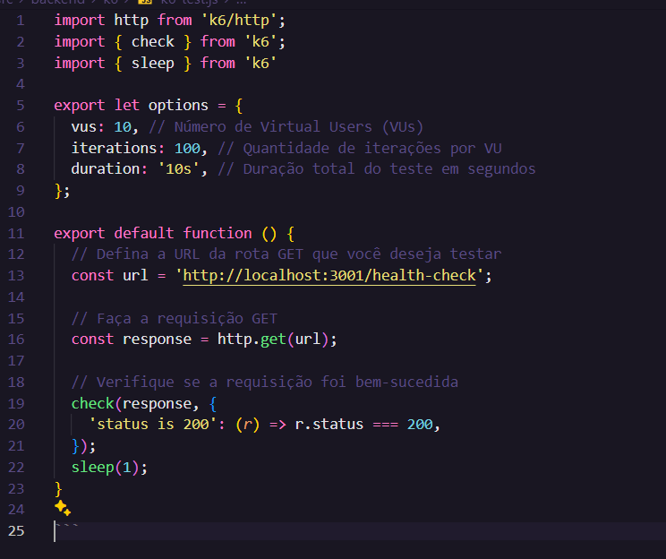
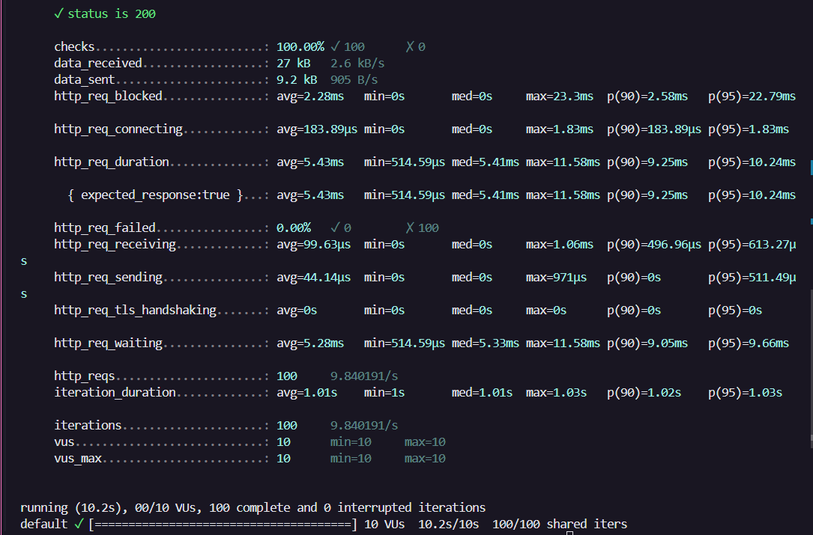
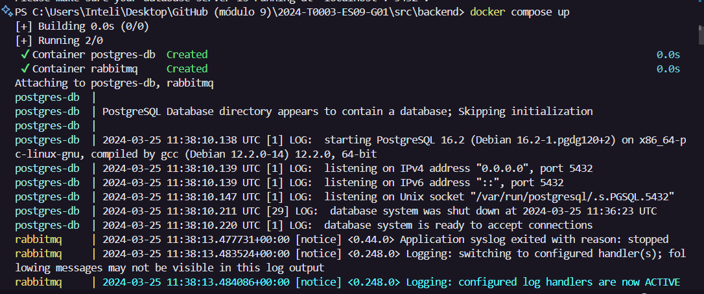
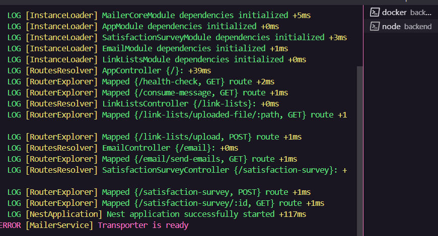
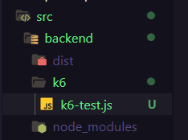
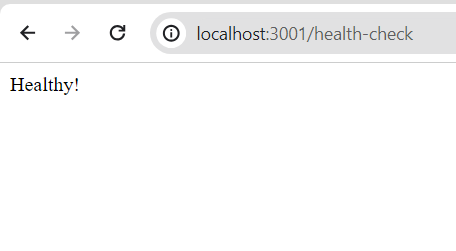
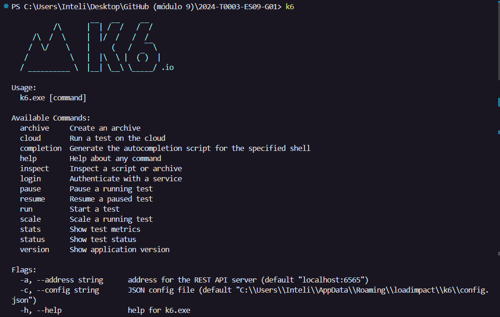
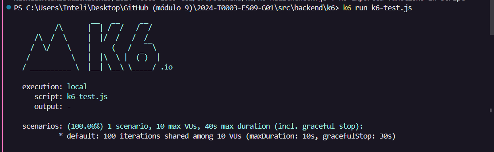

# M9S7-Ponderada2-Performance

## Introdução 
Este relatório descreve o processo de avaliação de performance da aplicação M9S7-Ponderada2 utilizando a ferramenta k6. O objetivo desta avaliação é identificar possíveis gargalos na aplicação e analisar seu comportamento sob carga simulada.

## Ferramenta utilizada (k6)
O k6 é uma ferramenta de teste de carga de código aberto, usada para medir o desempenho de sistemas web e APIs. Ele permite simular um grande número de usuários virtuais realizando diferentes tipos de solicitações HTTP, enquanto monitora e registra métricas importantes de desempenho.

## Procedimento
O processo de avaliação da performance da aplicação M9S7-Ponderada2 foi realizado em etapas:

- **Preparação do ambiente:** Garantir que o ambiente de teste esteja configurado corretamente, incluindo a inicialização do backend da aplicação e a configuração do k6.
- **Criação do script de teste:** Desenvolver um script de teste utilizando o k6, que consiste em definir os cenários de teste, incluindo as solicitações HTTP a serem enviadas para a aplicação.
- **Execução do teste:** Rodar o script de teste utilizando o k6 para simular a carga na aplicação e coletar métricas de desempenho.
- **Análise dos resultados:** Analisar as métricas de desempenho coletadas durante o teste para identificar possíveis gargalos na aplicação e áreas de melhoria.

## Conceitos aprendidos
Durante o processo de avaliação, adquiri conhecimento sobre os Virtual Users, que são representações virtuais de usuários reais, simulando interações com a aplicação durante os testes de carga. Cada Virtual User executa o script de teste de forma autônoma, contribuindo para a geração de tráfego simulado na aplicação. No contexto da avaliação de desempenho, as solicitações HTTP são encaminhadas aos endpoints da aplicação para análise de métricas como tempo de resposta, taxa de sucesso e outros parâmetros relacionados ao desempenho.

Além disso, compreendi o papel fundamental dos Scripts de Teste, que consistem em conjuntos de instruções e comandos que definem o comportamento dos Virtual Users durante os testes de carga. Esses scripts podem incluir a configuração de payloads, headers, solicitações HTTP e verificações de resposta, proporcionando uma avaliação abrangente do desempenho da aplicação.

Por fim, explorei a importância das métricas de performance, que representam dados quantitativos essenciais para compreender o desempenho da aplicação durante os testes de carga. Essas métricas englobam informações como tempo de resposta das solicitações, taxa de solicitações por segundo, taxa de erro, entre outros, fornecendo insights valiosos para a otimização e o aprimoramento contínuo da aplicação.

## Explicação do código de teste

 

**1. Imports:**
- **import http from 'k6/http';:** Importa o módulo HTTP do k6, que fornece funções para enviar solicitações HTTP durante o teste.
- **import { check } from 'k6';:** Importa a função check do k6, que é usada para validar as respostas HTTP recebidas durante o teste.
- **import { sleep } from 'k6';:** Importa a função sleep do k6, que é usada para adicionar atrasos entre as solicitações durante o teste.

**2. Configuração de opções:**
- **options:** Define as opções de execução do teste, como o número de Virtual Users (VUs), a quantidade de iterações por VU e a duração total do teste. Neste caso, está configurado para simular 10 VUs, cada um realizando 100 iterações durante 10 segundos.

**3. Função de teste:**
- **export default function () { ... }:** Define a função principal do teste. Esta função será chamada repetidamente pelo k6 durante a execução do teste.

**4. Solicitação HTTP:**

- **const url** = 'http://localhost:3001/health-check';: Define a URL da rota GET que será testada. Neste caso, é uma rota de verificação de saúde em localhost na porta 3001.
- **const response = http.get(url);:** Envia uma solicitação GET para a URL definida e armazena a resposta.

**5. Validação da resposta:**

- **check(response, { ... });:** Usa a função check para validar a resposta da solicitação. Neste caso, verifica se o status da resposta é 200 (OK).

**6. Atraso:**

- **sleep(1);:** Adiciona um atraso de 1 segundo entre as solicitações. Isso pode ser usado para simular um comportamento mais realista de usuários interagindo com o sistema.

## Interpretação dos resultados K6
 
- **Status is 200:** Isso significa que todas as solicitações HTTP feitas durante o teste retornaram um status 200 (OK).
- **Checks:** Indica que todas as verificações definidas no script foram bem-sucedidas. Neste caso, todas as solicitações retornaram o status esperado (200).
- **Data received:** Mostra a quantidade total de dados recebidos do servidor durante o teste. No total, foram recebidos 27 kB, a uma taxa média de 2.6 kB/s.
- **Data sent:** Indica a quantidade total de dados enviados para o servidor durante o teste. Foram enviados 9.2 kB, a uma taxa média de 905 B/s.
- **HTTP request blocked:** Fornece estatísticas sobre o tempo médio que as solicitações passaram bloqueadas antes de serem enviadas. Isso inclui tempos de espera em filas de solicitação.
- **HTTP request connecting:** Mostra o tempo médio que as solicitações levam para se conectar ao servidor.
- **HTTP request duration:** Indica a duração média de uma solicitação HTTP, desde o início até o recebimento da resposta completa do servidor.
- **HTTP request failed:** Mostra a porcentagem de solicitações que falharam durante o teste. Neste caso, todas as solicitações foram bem-sucedidas (0% de falha).
- **HTTP request receiving:** Indica o tempo médio que as solicitações levam para receber a resposta do servidor.
- **HTTP request sending:** Mostra o tempo médio que as solicitações levam para serem enviadas para o servidor.
- **HTTP request TLS handshaking:** Indica o tempo médio gasto no handshake TLS (se as solicitações estiverem usando HTTPS).
- **HTTP request waiting:** Mostra o tempo médio que as solicitações levam enquanto esperam por uma resposta do servidor.
- **HTTP requests:** Mostra o número total de solicitações HTTP feitas durante o teste, bem como a taxa de solicitações por segundo.
- **Iteration duration:** Indica a duração média de uma iteração completa do teste. Isso inclui o tempo gasto na execução do script e o tempo de espera entre as iterações.
- **Iterations:** Mostra o número total de iterações completas do teste.
- **VUs (Virtual Users):** Mostra o número atual de usuários virtuais simulados durante o teste.
- **VUs max:** Indica o número máximo de usuários virtuais configurados para este teste.
 
 
 
# Passo a passo da atividade

#### Rodar o backend - npx prisma generate
#### Rodar o backend - npx prisma migrate dev
#### Rodar o backend - docker compose up

#### Rodar o backend - nest start --watch

#### Criar no backend pasta k6 com arquivo de teste .js

#### Verificar rota do endpoint escolhido

#### Revisar instalação do K6

#### Rodar o teste K6

